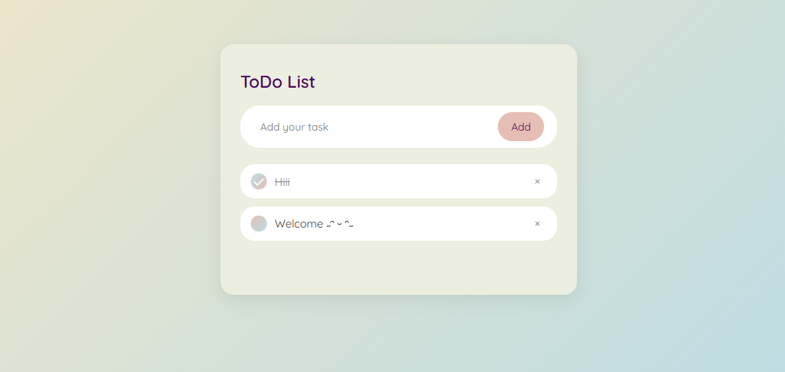

# 🌸 Sepinood's Pastel To-Do List

A responsive, pastel-themed to-do list built with **HTML**, **CSS**, and **vanilla JavaScript**.  
Tasks are stored locally using browser memory (`localStorage`) and persist across sessions.

## ✨ Features

- Beautiful pastel UI with custom checkbox animations
- Add, complete, and delete tasks with smooth transitions
- Local storage support — your tasks stay even after refresh
- Fully responsive design for desktop and mobile

## 📸 Preview

## 🚀 Live Demo

👉 [Click here to view the live project](https://github.com/sepinoodl/Todo-list.git)

## 🛠️ Technologies Used

- HTML5
- CSS3 (Flexbox, gradients, media queries)
- JavaScript (ES6)
- LocalStorage API
- Google Fonts: Quicksand

## 📁 Folder Structure

├── index.html 
├── list.css 
├── list.js 
├── images/ 
│ └── todoLogo.png
│ └── todoScreenshot.png

## 🧠 About Me

This project was designed and developed by **Sepinood Langari**, a front-end developer passionate about clean UI, responsive layouts, and modern web aesthetics.
